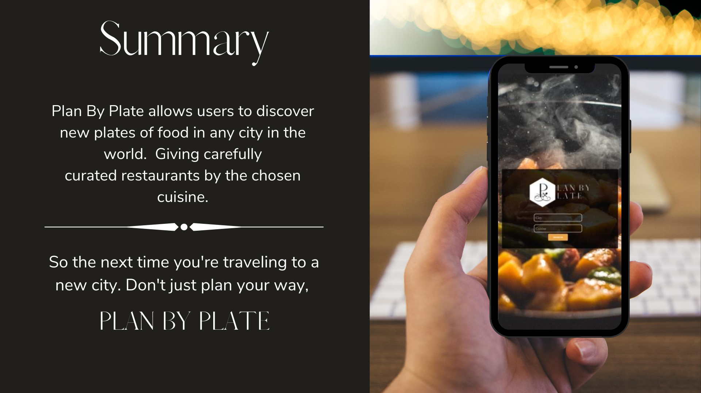

### The function below uses the Google Maps JavaScript API, and the Google Places API.
```Javascript
$(function getAutocomplete() {
  $(".wrapper").hide(0).fadeIn(1500);

  var autoComplete = new 
  google.maps.places.Autocomplete((document.getElementById("search-term")), {
    types: ['geocode']
  });

    google.maps.event.addListener(autoComplete, "place_changed", function() {
      var near_place = autoComplete.getPlace();

      document.getElementById("latitude-input").value = 
      near_place.geometry.location.lat();

      document.getElementById("longitude-input").value = 
      near_place.geometry.location.lng();
    });
  });
 ```
 #### Documentation on how the two Google API's interact with each other, and how the autocomplete function works can be found here.
  ### - <a href="https://developers.google.com/places/web-service/autocomplete">Google Places API</a>
  ### - <a href="https://developers.google.com/maps/documentation/javascript/overview">Google Maps JavaScript API</a>


#### Once the getAutocomplete() function gets the city from the user input. The latitude and longitude from that city will need to be passed as required parameters into our next API.
#### Below is an example of how that information is passed into our Zomato API call.


#### In reference to the Zomato API, the /search endpoint is being used. Below is a link to the documentation.
### <a href="https://developers.zomato.com/documentation">Zomato API</a>



## Come find your plate. https://bhopper197.github.io/plan-by-plate/
